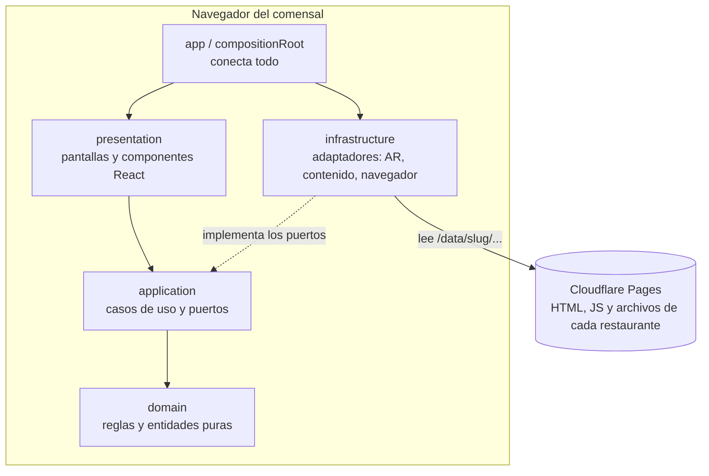
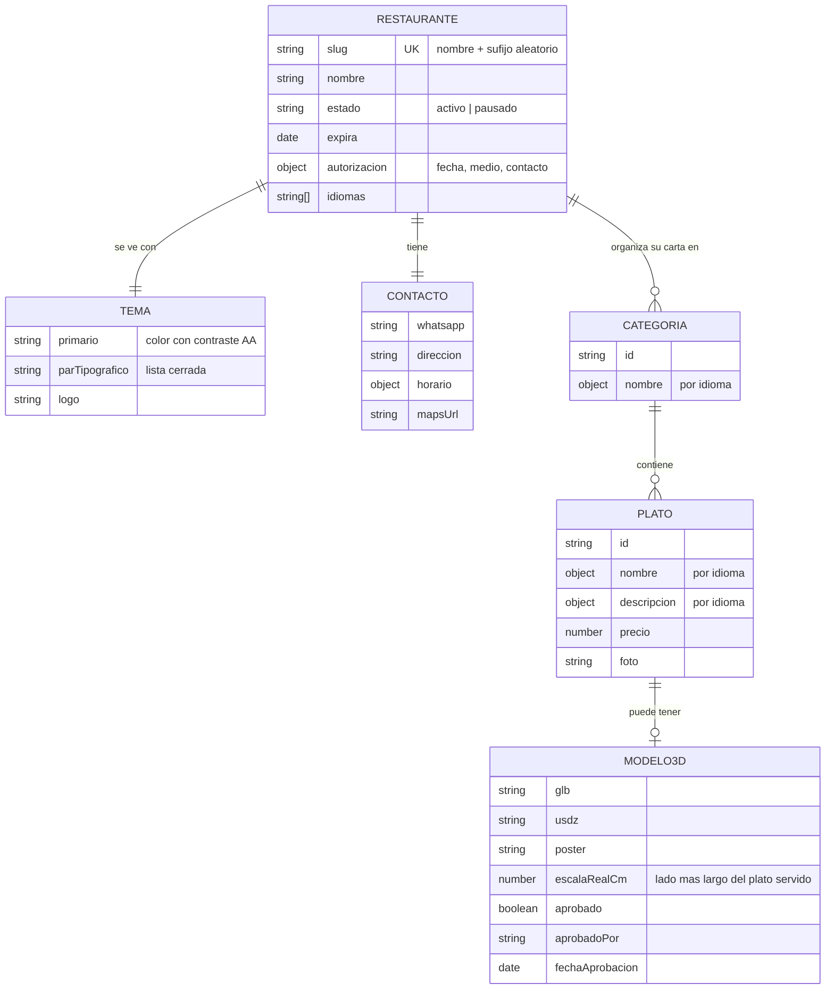

<div align="center">

# 🔥 Ascua – Demo Multi-restaurante

**Carta digital y página web para restaurantes, con platos en 3D y realidad aumentada que el comensal ve sobre su propia mesa, desde el celular y sin instalar nada.**

Demo estática multi-restaurante de **PITS**: una sola plantilla, un paquete de contenido aislado por restaurante, arquitectura por capas y CI/CD estricto.


<!-- Activar cuando el CI esté en verde en main:
[](https://github.com/Juanjo1414/ASCUA-DEMO-PAGINA/actions/workflows/ci.yml)
-->

</div>

---

## Tabla de contenido

1. [Descripción del proyecto](#descripción-del-proyecto)
2. [Equipo](#equipo)
3. [Cómo la vive el comensal](#cómo-la-vive-el-comensal)
4. [Arquitectura](#arquitectura)
5. [Stack tecnológico](#stack-tecnológico)
6. [Modelo de contenido](#modelo-de-contenido)
7. [Seguridad y privacidad](#seguridad-y-privacidad)
8. [Quién hace qué](#quién-hace-qué)
9. [Puesta en marcha en modo desarrollo](#puesta-en-marcha-en-modo-desarrollo)
10. [Despliegue](#despliegue)
11. [Variables de entorno](#variables-de-entorno)
12. [URLs y puertos](#urls-y-puertos)
13. [Pruebas automatizadas y CI/CD](#pruebas-automatizadas-y-cicd)
14. [Restaurantes de ejemplo](#restaurantes-de-ejemplo)
15. [Ejemplo de un restaurante](#ejemplo-de-un-restaurante)
16. [Limitaciones conocidas](#limitaciones-conocidas)
17. [Mejoras futuras](#mejoras-futuras)
18. [Documentación](#documentación)
19. [Contribuir](#contribuir)
20. [Licencia](#licencia)

---

## Descripción del proyecto

Un plato descrito en texto o en una foto pequeña no le dice al comensal cuánto trae ni cómo se ve. **Ascua** resuelve eso: el cliente escanea un QR en la mesa, abre la carta en su celular y, con un toque en **"Ver en mi mesa"**, el plato aparece sobre su mesa en **tamaño real** gracias a la realidad aumentada (AR). Sin descargar aplicaciones y sin saber nada de tecnología.

Este repositorio es la **demo estática multi-restaurante** con la que **PITS** (Purpose Innovation Technology Solutions, Medellín) quiere que **restaurantes reales prueben el producto** y respondan una pregunta simple: _¿pagarían la suscripción?_ Cada restaurante recibe su propia página (información, horarios, ubicación, reservas por WhatsApp) y su propia carta con platos en 3D/AR, con su marca y sus colores, **ya creados, probados y aprobados** por el equipo.

Como la ven usuarios reales, casi siempre desde el celular y muchas veces personas poco familiarizadas con la tecnología, el proyecto se construye con tres prioridades: **que se entienda solo**, **que funcione bien en móvil** y **que nada se publique sin pasar todas las pruebas**.

> 🚧 **Estado (verificado el 9 de octubre de 2026):** la re-arquitectura, el soporte multi-restaurante, la experiencia del comensal, el QR imprimible y el despliegue en Cloudflare Pages ya están completos y en producción de preview (`npm run verify` pasa completo: lint, tipos, 145 pruebas, reglas de capas, validación de contenido, accesibilidad con axe, Lighthouse y build; CI de GitHub Actions en verde de punta a punta, incluido `deploy`/`smoke`). Todavía **falta** generar los modelos 3D reales de la demo genérica (P-601) y el diseño visual definitivo cuando se cargue `docs/DESIGN.md` actualizado. Avance al detalle en [`docs/ESTADO.md`](./docs/ESTADO.md) y hoja de ruta en [`docs/PLAN-IMPLEMENTACION.md`](./docs/PLAN-IMPLEMENTACION.md).

| Área                                                                                                         | Estado |
| :----------------------------------------------------------------------------------------------------------- | :----: |
| Fundaciones: Node 22, hooks locales, reglas para agentes, graphify, CI/CD, sin dependencia de terceros       |   ✅   |
| TypeScript, Vitest y capas `domain` / `application` / `infrastructure` con reglas verificadas                |   ✅   |
| Adaptadores de AR conectados a la interfaz, con lanzador compuesto                                           |   ✅   |
| Contenido por restaurante: esquema, plantilla, validador y HTML por restaurante                              |   ✅   |
| Prueba E2E de aislamiento entre restaurantes (Playwright)                                                    |   ✅   |
| Guía previa al AR, ayuda flotante, estados de error, modo presentación, feedback, analítica y avisos legales |   ✅   |
| Interfaz en `src/presentation/` con la regla de capas activa                                                 |   ✅   |
| Página gobernada por los datos del restaurante (nombre, logo, tema, contacto, portada)                       |   ✅   |
| Diseño mobile-first, accesibilidad (axe) y Lighthouse CI en verde                                            |   ✅   |
| Demo genérica `ascua-demo-abcd` con fotos (modelos 3D aprobados pendientes, P-601)                           |   🚧   |
| Página de QR imprimible                                                                                      |   ✅   |
| Cabeceras de seguridad y CSP                                                                                 |   ✅   |
| Presupuesto de rendimiento (Lighthouse CI) y licencias                                                       |   ✅   |
| Cloudflare Pages, protección de `main` y CodeQL                                                              |   ✅   |
| Prueba de usabilidad con 5 personas no técnicas (P-406)                                                      |   🗓️   |

## Equipo

| Integrante          | Rol                                                 |
| :------------------ | :-------------------------------------------------- |
| Juan José Jaramillo | Desarrollo full-stack, DevOps y producto de la demo |

<!-- Agrega aquí al resto del equipo de PITS con su rol. -->

El repositorio hermano [`ASCUA-DEMO-AR`](https://github.com/Juanjo1414/ASCUA-DEMO-AR) (ARFOODS) es el **Estudio 3D** que produce los modelos que se publican aquí.

## Cómo la vive el comensal

1. **Escanea el QR** de la mesa y se abre la carta del restaurante.
2. **Toca un plato** y lo ve en 3D; puede girarlo con el dedo.
3. **Toca "Ver en mi mesa"**. Una guía corta le dice qué hacer: apuntar la cámara a la mesa y mover el teléfono despacio hasta que aparezca el plato.
4. El plato aparece **apoyado sobre la mesa y en su tamaño real**, para ver la porción tal como se la servirán.

| Dispositivo                               | Cómo se abre el AR                                                                                     |
| :---------------------------------------- | :----------------------------------------------------------------------------------------------------- |
| iPhone (Safari)                           | AR Quick Look, con el archivo `.usdz`                                                                  |
| Android (Chrome)                          | Google Scene Viewer, con el archivo `.glb`                                                             |
| Computador, o teléfono sin AR             | Visor 3D dentro de la página: el plato se puede girar                                                  |
| Navegador de Instagram, WhatsApp, TikTok… | Aviso amable para abrir el enlace en el navegador del teléfono, porque esos navegadores bloquean el AR |

**Principios de experiencia** que guían el diseño:

- **Mobile-first:** se diseña desde 360 px de ancho; botones táctiles de al menos 48 px; sin scroll horizontal.
- **Sin tecnicismos:** el botón dice "Ver en mi mesa", no "AR".
- **Ayuda siempre a mano:** un botón "¿Cómo funciona?" y una guía la primera vez.
- **Todos los estados tienen diseño:** cargando, error (con una acción clara), sin conexión, plato agotado, teléfono sin AR.
- **Escala fija y real:** el comensal no puede agrandar el plato (Estatuto del Consumidor, Ley 1480 de 2011).

## Arquitectura

La demo es un **sitio estático**: no tiene servidor ni base de datos. Los datos de cada restaurante son archivos versionados en el repositorio, y el código sigue una **arquitectura por capas** con una única regla: las dependencias solo apuntan hacia el centro.



**Flujo de una visita:** el comensal abre `/r/<restaurante>/` → el `compositionRoot` arma los adaptadores → el caso de uso `getRestaurant` pide los datos al puerto `RestaurantRepository` → su implementación (`StaticJsonRestaurantRepository`) valida el slug, hace `fetch` del `restaurant.json` de **ese** restaurante y lo valida con esquema → la interfaz pinta la carta con los datos de ese restaurante → al tocar "Ver en mi mesa", el caso de uso `launchDishAr` pregunta al detector de dispositivo qué modo corresponde (dominio puro, `selectArLaunchMode`) y delega en el lanzador adecuado (Quick Look, Scene Viewer o el visor de respaldo en pantalla). El recorrido completo, archivo por archivo, está en [`docs/ARQUITECTURA.md`](./docs/ARQUITECTURA.md).

| Capa                  | Responsabilidad                                                                                                     | Puede importar          |
| :-------------------- | :------------------------------------------------------------------------------------------------------------------ | :---------------------- |
| `src/domain/`         | Entidades, esquemas y reglas puras: qué es un plato, un restaurante, cómo se decide el modo de AR                   | Nada                    |
| `src/application/`    | Casos de uso y puertos (interfaces)                                                                                 | `domain`                |
| `src/infrastructure/` | Adaptadores concretos: Quick Look, Scene Viewer, lectura de contenido, detección de navegador, almacenamiento local | `application`, `domain` |
| `src/presentation/`   | Pantallas, componentes, tema visual, i18n y hooks de React                                                          | `application`, `domain` |
| `src/app/`            | Punto de arranque: `compositionRoot` (instancia los adaptadores), contexto de dependencias y router                 | Todas                   |

La regla de dependencias se verifica con `npm run arch:check` (dependency-cruiser) dentro de `npm run verify`, sobre las 4 capas, sin excepciones. Los principios **SOLID** se aplican de forma concreta (por ejemplo, cada modo de AR es un adaptador intercambiable con el mismo contrato); están explicados en la sección 3.3 del [plan](./docs/PLAN-IMPLEMENTACION.md). Cada capa tiene su propio `README.md` corto con el detalle de qué vive ahí.

### Estructura del repositorio

```text
ASCUA-DEMO-PAGINA/
├── CLAUDE.md · AGENTS.md          # Reglas para agentes de IA (Claude Code, Antigravity)
├── docs/
│   ├── PLAN-IMPLEMENTACION.md     # Plan con tareas, criterios y riesgos
│   ├── PLAN-REVISION.md           # Plan de la revisión integral post-Antigravity
│   ├── ESTADO.md                  # Dónde vamos y siguiente paso exacto
│   ├── ARQUITECTURA.md            # Recorrido de "Ver en mi mesa", archivo por archivo
│   ├── DESIGN.md · PRODUCT.md · PROYECTO.md
│   ├── adr/                       # Decisiones de arquitectura
│   ├── runbooks/                  # nuevo-restaurante.md, qa-dispositivos.md, configuración manual
│   ├── seguridad/                 # Reportes de auditoría
│   ├── revision/                  # Inventario y matriz de cumplimiento de la revisión
│   └── sesiones/                  # Bitácora de cada sesión de trabajo
├── content/
│   ├── restaurants/_plantilla/    # Restaurante de ejemplo para copiar (nunca se publica)
│   └── raw/                       # Material original (fotos de platos, video) — ya no usado en la UI
├── scripts/
│   ├── validate-content.ts        # Valida el contenido de cada restaurante
│   └── build-content.ts           # Copia el contenido y genera el HTML de cada restaurante
├── src/
│   ├── domain/                    # Reglas puras y esquemas zod
│   ├── application/                # Puertos y casos de uso
│   ├── infrastructure/             # Adaptadores: AR, contenido, navegador, almacenamiento, analítica
│   ├── presentation/                # Pantallas, componentes, i18n, tema, hooks
│   ├── app/                         # compositionRoot, router
│   ├── shared/                      # Constantes compartidas sin capa propia
│   └── main.tsx
├── tests/
│   ├── unit/                      # Vitest: domain, application, infrastructure, presentation, scripts
│   ├── e2e/                       # Playwright: aislamiento, recorrido del comensal, accesibilidad
│   └── fixtures/restaurants/      # Restaurantes de prueba
├── .github/workflows/             # ci.yml y deploy.yml
├── .dependency-cruiser.cjs        # Reglas de capas
└── graphify-out/                  # Grafo de conocimiento del repo
```

## Stack tecnológico

| Capa       | Tecnología                                                                              |
| :--------- | :-------------------------------------------------------------------------------------- |
| Interfaz   | React 19, Tailwind CSS 3.4, lucide-react, React Router 7                                |
| Estado     | jotai                                                                                   |
| Build      | Vite 8                                                                                  |
| Lenguaje   | TypeScript 5.6 estricto, 100 % de `src/` ya migrado a `.tsx`/`.ts`                      |
| Validación | zod 4 (esquemas de dominio y de contenido)                                              |
| 3D y AR    | `@google/model-viewer`, AR Quick Look (iOS), Google Scene Viewer (Android)              |
| Animación  | GSAP                                                                                    |
| Pruebas    | Vitest, Testing Library, Playwright, `@axe-core/playwright`, Lighthouse CI              |
| Calidad    | oxlint, Prettier, dependency-cruiser, husky + lint-staged, gitleaks, CodeQL, Dependabot |
| Hosting    | Cloudflare Pages (Direct Upload), desplegado solo desde GitHub Actions                  |

## Modelo de contenido

Todo lo de un restaurante vive en **su propia carpeta**, separado del código. Agregar un restaurante es agregar una carpeta, sin tocar `src/`.



```text
content/restaurants/
└── la-brasa-7k2p/               ← nombre + sufijo aleatorio (no adivinable)
    ├── restaurant.json          ← nombre, tema, contacto, carta y platos
    └── assets/
        ├── logo.svg
        └── platos/<plato>/
            ├── modelo.glb       ← AR en Android y visor 3D
            ├── modelo.usdz      ← AR en iPhone
            ├── poster.webp      ← imagen mientras carga el 3D
            └── foto.webp
```

El esquema vive en `src/domain/restaurant.ts` (zod) y `content/restaurants/_plantilla/restaurant.json` es un ejemplo completo y válido para copiar (guía paso a paso en [`docs/runbooks/nuevo-restaurante.md`](./docs/runbooks/nuevo-restaurante.md)).

**Qué comprueba `npm run content:validate`** (corre en `npm run verify` y en el CI):

| Regla                                                                   | Resultado si falla |
| :---------------------------------------------------------------------- | :----------------: |
| Existe `restaurant.json` y cumple el esquema                            |      ❌ error      |
| El `slug` coincide con el nombre de la carpeta                          |      ❌ error      |
| Ninguna ruta sale de la carpeta del restaurante (`..`, rutas absolutas) |      ❌ error      |
| Todo archivo referenciado existe                                        |      ❌ error      |
| Peso máximo: GLB 5 MB, USDZ 8 MB, WebP y SVG 300 KB                     |      ❌ error      |
| Todo plato con modelo 3D está **aprobado**                              |      ❌ error      |
| Restaurante con fecha `expira` vencida                                  |      ⚠️ aviso      |
| Dos restaurantes comparten un archivo idéntico (mismo hash)             |      ⚠️ aviso      |

Después, `build-content.ts` copia el contenido a `dist/data/<slug>/` y genera `dist/r/<slug>/index.html` con título, descripción y OpenGraph propios (buena vista previa al compartir por WhatsApp) y `noindex`, además del archivo `_redirects` para Cloudflare Pages.

## Seguridad y privacidad

- **Sin backend ni base de datos:** es un sitio estático; no hay servidor que atacar ni datos de usuarios que filtrar.
- **Aislamiento entre restaurantes por diseño:** cada archivo debe vivir dentro de su carpeta; una prueba E2E confirma que, al abrir un restaurante, **nunca se pide nada de otro**; los slugs llevan un sufijo aleatorio, no existe una página que liste los restaurantes y se pide a los buscadores no indexarlos.
- **Validación de toda entrada externa:** el JSON de cada restaurante y los parámetros de la URL se validan con esquema antes de usarse; un slug inválido se rechaza sin hacer ninguna petición.
- **Sin cookies, sin cuentas y sin datos personales del comensal** (Ley 1581 de 2012). La analítica planeada es agregada y sin cookies.
- **Cabeceras de seguridad y CSP propias**, sin dominios de terceros salvo Cloudflare Analytics (documentado en el ADR 0004), en `public/_headers`: CSP, HSTS, `X-Frame-Options`, `nosniff`, `Referrer-Policy`, `Permissions-Policy` coherente con cámara/AR.
- **Contenido con autorización:** un restaurante solo se publica con su autorización registrada, y cada demo tiene fecha de vencimiento, tras la cual se borra su carta y sus fotos.
- **Modelos 3D honestos:** se muestran a escala fija y real, con el disclaimer de la Ley 1480 de 2011 visible.
- **Calidad de la cadena de suministro:** escaneo de secretos con gitleaks (configurado en `.gitleaks.toml`, corre en cada push), `npm audit` que bloquea vulnerabilidades altas de producción, Dependabot (npm + GitHub Actions, semanal) y CodeQL (semanal, activo desde X-008). Se prohíben las dependencias con licencia GPL/AGPL.
- **Despliegue controlado:** producción solo se publica desde GitHub Actions con todos los controles en verde; rama `main` protegida contra push directo y force-push.
- Auditorías de referencia: [`docs/seguridad/2026-08-28-cyber-neo.md`](./docs/seguridad/2026-08-28-cyber-neo.md) y [`docs/seguridad/2026-10-09.md`](./docs/seguridad/2026-10-09.md) (la más reciente).

> ⚠️ El aislamiento por diseño **no es control de acceso**: es suficiente porque lo publicado es una carta pública. El aislamiento fuerte, con autenticación y políticas por fila, vive en la plataforma [ARFOODS](https://github.com/Juanjo1414/ASCUA-DEMO-AR).

## Quién hace qué

| Actor                                       | Qué hace                                                                                                                                       |
| :------------------------------------------ | :--------------------------------------------------------------------------------------------------------------------------------------------- |
| **Comensal**                                | Escanea el QR, mira la carta, ve los platos en 3D/AR, reserva por WhatsApp y deja su opinión. No necesita cuenta.                              |
| **Restaurante (dueño)**                     | Entrega su carta y sus fotos, **autoriza por escrito** su uso, prueba la demo y responde el feedback. En esta etapa **no edita** su contenido. |
| **Equipo PITS**                             | Prepara el contenido de cada restaurante, produce y **aprueba** los modelos 3D tras probarlos en un iPhone y un Android reales, y publica.     |
| **Agente de IA** (Claude Code, Antigravity) | Implementa tareas siguiendo `CLAUDE.md`; **nunca** marca un modelo como aprobado, ni publica sin que se le pida.                               |

## Puesta en marcha en modo desarrollo

Requisitos: [Node.js 22 LTS](https://nodejs.org) y Git.

```powershell
git clone https://github.com/Juanjo1414/ASCUA-DEMO-PAGINA.git
cd ASCUA-DEMO-PAGINA
git checkout dev/Juanjo

npm ci
npm run dev
```

Vite sirve el sitio en `http://localhost:5173`.

| Comando                    | Qué hace                                                                                                |
| :------------------------- | :------------------------------------------------------------------------------------------------------ |
| `npm run dev`              | Servidor de desarrollo                                                                                  |
| `npm run verify`           | Corre **todo**, igual que el CI: lint, tipos, pruebas, reglas de capas, validación de contenido y build |
| `npm run lint`             | Revisa el código con oxlint                                                                             |
| `npm run typecheck`        | Comprueba los tipos de TypeScript                                                                       |
| `npm run test`             | Pruebas unitarias (Vitest)                                                                              |
| `npm run test:coverage`    | Pruebas unitarias con informe de cobertura                                                              |
| `npm run test:e2e`         | Pruebas de extremo a extremo (Playwright; requiere `npx playwright install` la primera vez)             |
| `npm run arch:check`       | Verifica la regla de dependencias entre capas                                                           |
| `npm run content:validate` | Valida el contenido de cada restaurante                                                                 |
| `npm run build`            | Genera `dist/` y el HTML de cada restaurante                                                            |
| `npm run preview`          | Sirve `dist/` para revisarlo                                                                            |
| `npm run format`           | Da formato al código con Prettier                                                                       |

Los hooks de Git los instala `npm ci` (husky): al hacer _commit_ se revisan los archivos tocados y al hacer _push_ corre `npm run verify`.

> 📲 **El AR no funciona contra `localhost`:** el teléfono exige HTTPS. Para probarlo en un celular real usa la URL de _preview_ que genera el CI en cada cambio de `dev/Juanjo`.

## Despliegue

El despliegue es automático y **solo ocurre si todos los controles pasan**:

```text
dev/Juanjo ──► pruebas locales (pre-push) ──► CI en GitHub ──► preview en Cloudflare Pages
                                                                     │ se prueba en un iPhone y un Android
                                                                     ▼
                                          Pull Request ──► main ──► producción ──► prueba de humo
```

- Todo el trabajo ocurre en `dev/Juanjo`; `main` es producción y nunca se toca directamente.
- Se publica **el mismo build** que pasó las pruebas, mediante GitHub Actions (modo _Direct Upload_ de Cloudflare Pages, sin integración Git automática).
- Si la prueba de humo en producción falla, se revierte al despliegue anterior desde _Cloudflare Pages → Deployments → Rollback_.
- Cada rama tiene una URL de _preview_ para revisar antes de fusionar.

> ✅ El proyecto `ascua-demo-pagina` ya existe en Cloudflare Pages (Direct Upload) y los secretos están cargados. Preview de `dev/Juanjo`: `https://ascua-demo-pagina.pages.dev`. Producción se activa con el primer merge a `main`.

Secretos y variables de GitHub Actions: `CLOUDFLARE_API_TOKEN` y `CLOUDFLARE_ACCOUNT_ID` (secretos); `CF_PAGES_PROJECT` y `PROD_URL` (variables) — ver [`docs/runbooks/configuracion-github-cloudflare.md`](./docs/runbooks/configuracion-github-cloudflare.md) si necesitas recrearlos.

## Variables de entorno

La demo **no necesita ninguna variable de entorno** para funcionar: todo el contenido es estático.

| Variable                                       | Estado                       | Descripción                                                                                                                                                                                                                |
| :--------------------------------------------- | :--------------------------- | :------------------------------------------------------------------------------------------------------------------------------------------------------------------------------------------------------------------------- |
| `VITE_SUPABASE_URL` / `VITE_SUPABASE_ANON_KEY` | Opcional, vacías por defecto | Las lee `src/lib/arAssets.js`, código heredado de la versión original para cargar modelos remotos. Ya no apuntan a ningún proyecto de terceros y se retirarán junto con ese archivo. **No las uses para contenido nuevo.** |

Las variables de GitHub Actions para el despliegue se describen en la sección anterior.

## URLs y puertos

| Componente               | Desarrollo                          | Preview / Producción                       |
| :----------------------- | :---------------------------------- | :----------------------------------------- |
| Página genérica de Ascua | http://localhost:5173/              | `https://<proyecto>.pages.dev/`            |
| Restaurante              | http://localhost:5173/r/`<slug>`/   | `https://<proyecto>.pages.dev/r/<slug>/`   |
| QR imprimible            | http://localhost:5173/r/`<slug>`/qr | `https://<proyecto>.pages.dev/r/<slug>/qr` |
| Datos del restaurante    | `/data/<slug>/restaurant.json`      | `/data/<slug>/restaurant.json`             |

_Estado de las rutas:_ `/r/<slug>` ✅ (carta del restaurante) · `/r/<slug>/qr` ✅ (QR imprimible real, con logo y color del restaurante) · `/` ✅ (a propósito minimalista: nunca lista restaurantes, por regla de seguridad) · `/expirado` ✅ · cualquier otra ruta muestra un 404.

## Pruebas automatizadas y CI/CD

Estado verificado el 9 de octubre de 2026:

| Nivel         | Herramienta                                                              | Qué cubre                                                                                                                                                  | Estado |
| :------------ | :----------------------------------------------------------------------- | :--------------------------------------------------------------------------------------------------------------------------------------------------------- | :----: |
| Unitarias     | Vitest                                                                   | **145 pruebas**: dominio, casos de uso, adaptadores de AR, detector de navegador, repositorio/validador/build de contenido, componentes de `presentation/` |   ✅   |
| Cobertura     | `@vitest/coverage-v8`                                                    | 97 % de líneas y 92 % de ramas en `domain/`+`application/`; `presentation/` todavía no entra en el umbral obligatorio                                      |   ✅   |
| Contrato      | Vitest                                                                   | Los tres lanzadores de AR, con los atributos exactos verificados (`rel="ar"`, `resizable=false`, `S.browser_fallback_url`...)                              |   ✅   |
| Arquitectura  | dependency-cruiser                                                       | Regla de dependencias entre capas (67 módulos, 0 violaciones)                                                                                              |   ✅   |
| Contenido     | `validate-content.ts`                                                    | Esquema, aislamiento, pesos, aprobación (ver tabla de reglas arriba)                                                                                       |   ✅   |
| E2E           | Playwright (Desktop Chrome, Pixel 5, iPhone 12)                          | Aislamiento entre restaurantes, recorrido completo del comensal y accesibilidad con axe — 25 pruebas en verde                                              |   ✅   |
| Componentes   | Testing Library                                                          | `Menu`, `ArGuideModal`, `ArDishModal`, `DishCard`, `Hero`, `Contacto`, `Reserva`, `Pie`                                                                    |   ✅   |
| Accesibilidad | `@axe-core/playwright`                                                   | 0 violaciones serias/críticas (WCAG 2.1 A/AA) en la carta y en la guía de AR                                                                               |   ✅   |
| Rendimiento   | Lighthouse CI (móvil, mediana de 5 corridas)                             | Performance, accesibilidad, buenas prácticas y SEO ≥ 0.9                                                                                                   |   ✅   |
| Responsive    | Playwright (360, 390, 430, 768, 1280 px)                                 | Revisión visual con capturas en los 5 anchos                                                                                                               |   🗓️   |
| Usabilidad    | Prueba con 5 personas no técnicas                                        | "Encuentra un plato y míralo sobre tu mesa" sin ayuda (meta: ≥ 4 de 5)                                                                                     |   🗓️   |
| Manual        | [`docs/runbooks/qa-dispositivos.md`](./docs/runbooks/qa-dispositivos.md) | Checklist listo; falta correrlo en dispositivos reales antes de aprobar el primer modelo 3D (P-601)                                                        |   🗓️   |

Además, en cada push corren el escaneo de secretos (gitleaks), `npm audit` y CodeQL (semanal); Dependabot revisa dependencias de npm y de GitHub Actions cada semana.

```powershell
npm run verify         # lo mismo que corre el CI
npm run test:coverage  # con informe de cobertura
npm run test:e2e       # extremo a extremo
```

## Restaurantes de ejemplo

| Carpeta                                                                | Descripción                                                                                                                         | Estado |
| :--------------------------------------------------------------------- | :---------------------------------------------------------------------------------------------------------------------------------- | :----: |
| `content/restaurants/_plantilla/`                                      | Restaurante completo y válido para copiar al crear uno nuevo (La Brasa, con una hamburguesa sin modelo aprobado). Nunca se publica. |   ✅   |
| `tests/fixtures/restaurants/rest-a-1234`, `rest-b-5678`, `rest-c-9012` | Restaurantes de prueba para las pruebas de aislamiento y del recorrido de AR                                                        |   ✅   |
| `content/restaurants/ascua-demo-abcd/`                                 | Demo genérica de Ascua para el primer contacto con un restaurante                                                                   |   ⚠️   |
| `<restaurante>-xxxx/`                                                  | Demos personalizadas, con autorización del restaurante y fecha de vencimiento                                                       |   🗓️   |

`ascua-demo-abcd` ya tiene la estructura completa de contenido, pero todavía sin modelos 3D reales aprobados: generarlos es la tarea P-601, pendiente de que Juan provea sus credenciales del pipeline del repo `MENU AR - AR` (ver `docs/runbooks/configuracion-pipeline-3d.md`). El material original de la primera versión de la landing (fotos de 8 platos y un video, ya no usado en la interfaz actual) quedó archivado en `content/raw/`.

## Ejemplo de un restaurante

```jsonc
{
  "schemaVersion": 1,
  "slug": "la-brasa-7k2p",
  "estado": "activo",
  "expira": "2026-12-15",
  "autorizacion": {
    "fecha": "2026-10-10",
    "medio": "whatsapp",
    "contacto": "Nombre del dueño",
  },
  "nombre": "La Brasa",
  "idiomas": ["es", "en"],
  "tema": {
    "primario": "#C2410C",
    "parTipografico": "editorial",
    "logo": "assets/logo.svg",
  },
  "contacto": {
    "whatsapp": "573001234567",
    "direccion": "…",
    "horario": [],
    "mapsUrl": "https://…",
  },
  "categorias": [
    {
      "id": "fuertes",
      "nombre": { "es": "Platos fuertes", "en": "Mains" },
      "platos": [
        {
          "id": "hamburguesa-casa",
          "nombre": { "es": "Hamburguesa de la casa", "en": "House burger" },
          "precio": 28000,
          "foto": "assets/platos/hamburguesa-casa/foto.webp",
          "modelo": {
            "glb": "assets/platos/hamburguesa-casa/modelo.glb",
            "usdz": "assets/platos/hamburguesa-casa/modelo.usdz",
            "poster": "assets/platos/hamburguesa-casa/poster.webp",
            "escalaRealCm": 18,
            "aprobado": true,
            "aprobadoPor": "Juan",
            "fechaAprobacion": "2026-10-12",
          },
        },
      ],
    },
  ],
}
```

Las reservas son un enlace de WhatsApp con el mensaje ya escrito (`https://wa.me/<número>?text=…`, caso de uso `buildReservationLink`): funcionan de verdad y no necesitan servidor. Para ver el **modo presentación** (marcar platos como agotados delante del dueño) agrega `?demo=1` a la dirección; el estado se guarda solo en el navegador.

## Limitaciones conocidas

**Del producto**

- **El restaurante no edita su carta:** todo cambio lo hace el equipo de PITS. Es coherente con la instalación asistida del catálogo, pero no es autoservicio.
- **El aislamiento es por diseño, no por autenticación:** cualquiera que conozca la dirección exacta de un restaurante puede abrirla. Es aceptable porque lo publicado es una carta pública.
- **La calidad de los modelos 3D depende del generador** (los gratuitos varían según el plato); por eso cada modelo se revisa a mano y, si no queda bien, el plato se muestra solo con foto.
- **El AR requiere HTTPS y un teléfono compatible**; en navegadores embebidos (Instagram, WhatsApp) hay que abrir el enlace en el navegador del teléfono.
- **No hay reservas en línea ni pagos:** las reservas se resuelven por WhatsApp.
- La analítica es agregada y sin cookies: sirve para ver visitas por restaurante, no por persona.

**Deuda técnica conocida**

- **La medida real por plato** se aplica solo como escala fija en el visor; falta que cada modelo salga normalizado a su medida real desde el Estudio 3D y que el validador la compare con el `manifest.json` (±5 %) — bloqueado hasta que exista al menos un modelo real (R-8/P-601).
- **Demo genérica sin modelos 3D aprobados todavía:** `ascua-demo-abcd` ya existe con su estructura completa; generar y aprobar sus modelos es P-601, en curso.
- **CSP con `'unsafe-inline' 'unsafe-eval'`** en `script-src`, por cómo cargan hoy Vite/React y `@google/model-viewer` (documentado en el ADR 0004, no resuelto).
- **Chunk de `@google/model-viewer` > 1 MB** sin dividir con `import()` dinámico (Lighthouse ya pasa 0.9 en rendimiento sin esto, pero sigue siendo una mejora pendiente).

## Mejoras futuras

- Estadísticas de uso del AR por restaurante (cuántos tocan "Ver en mi mesa").
- Páginas de restaurante a medida (diseño propio) para los planes superiores del catálogo.
- Almacenamiento de modelos en un servicio de objetos (p. ej. Cloudflare R2) cuando la demo supere cientos de megas.
- Migrar el contenido a la plataforma ARFOODS (panel del restaurante, autoservicio y RLS) cuando haya clientes pagando.
- Una página de ayuda con un video corto de cómo ver el plato en la mesa.
- Reservas y pagos en línea (Wompi) como complemento del catálogo.

## Documentación

| Documento                                                                                                | Para qué sirve                                                 |
| :------------------------------------------------------------------------------------------------------- | :------------------------------------------------------------- |
| [`docs/PLAN-IMPLEMENTACION.md`](./docs/PLAN-IMPLEMENTACION.md)                                           | Plan completo, con tareas, criterios de aceptación y riesgos   |
| [`docs/PLAN-REVISION.md`](./docs/PLAN-REVISION.md)                                                       | Plan de la revisión integral post-Antigravity (R-0 a R-10)     |
| [`docs/ESTADO.md`](./docs/ESTADO.md)                                                                     | Dónde vamos y cuál es el siguiente paso exacto                 |
| [`docs/ARQUITECTURA.md`](./docs/ARQUITECTURA.md)                                                         | Recorrido completo, archivo por archivo, de "Ver en mi mesa"   |
| [`docs/revision/inventario.md`](./docs/revision/inventario.md)                                           | Matriz de cumplimiento contra el plan original                 |
| [`docs/adr/`](./docs/adr)                                                                                | Decisiones de arquitectura y por qué se tomaron                |
| [`CLAUDE.md`](./CLAUDE.md) / [`AGENTS.md`](./AGENTS.md)                                                  | Reglas del repositorio para agentes de IA                      |
| [`docs/runbooks/nuevo-restaurante.md`](./docs/runbooks/nuevo-restaurante.md)                             | Paso a paso para agregar un restaurante                        |
| [`docs/runbooks/qa-dispositivos.md`](./docs/runbooks/qa-dispositivos.md)                                 | Checklist de QA manual en iPhone/Android antes de aprobar AR   |
| [`docs/runbooks/configuracion-github-cloudflare.md`](./docs/runbooks/configuracion-github-cloudflare.md) | Protección de `main`, Cloudflare Pages, CodeQL                 |
| [`docs/runbooks/configuracion-pipeline-3d.md`](./docs/runbooks/configuracion-pipeline-3d.md)             | De dónde sale el `HF_TOKEN` para generar modelos 3D            |
| [`docs/DESIGN.md`](./docs/DESIGN.md)                                                                     | Dirección visual                                               |
| [`docs/PRODUCT.md`](./docs/PRODUCT.md)                                                                   | Posicionamiento del producto                                   |
| [`docs/PROYECTO.md`](./docs/PROYECTO.md)                                                                 | Descripción de la versión original de la landing _(histórico)_ |
| [`docs/seguridad/`](./docs/seguridad)                                                                    | Reportes de auditoría de seguridad                             |
| [`docs/sesiones/`](./docs/sesiones)                                                                      | Bitácora de cada sesión de trabajo                             |

## Contribuir

1. Trabaja siempre en `dev/Juanjo`. **Nunca** hagas push directo a `main`.
2. Antes de subir cambios, `npm run verify` debe pasar (un hook local lo comprueba).
3. Usa [Conventional Commits](https://www.conventionalcommits.org/es/) con el ID de la tarea, por ejemplo: `feat(P-202): valida rutas de assets del restaurante`.
4. Abre un Pull Request a `main` con la plantilla del repositorio; solo se fusiona con todos los controles en verde.
5. El código se documenta solo: encabezado en cada archivo, explicación en español de cada función exportada y comentarios que cuentan el _porqué_.

## Licencia

© 2026 PITS – Purpose Innovation Technology Solutions. **Todos los derechos reservados.**  
El código se publica para consulta y evaluación; no se concede permiso de uso comercial ni de redistribución sin autorización escrita.
